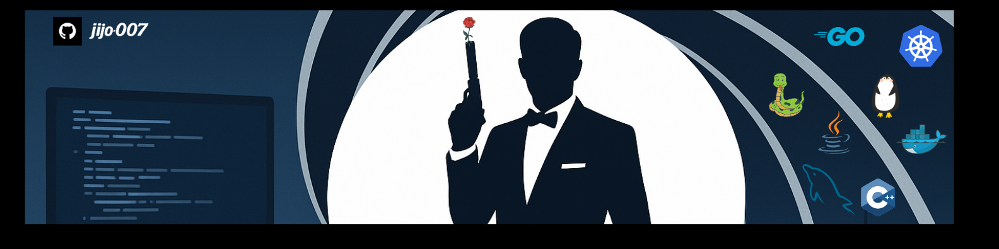

  

<h1 align="center">
  Hello World! , I'm Suman Mandal
  
</h1>

  

### :hammer_and_wrench: Languages and Tools

  &nbsp;
  &nbsp;
  &nbsp;
  &nbsp;
  &nbsp;
  &nbsp;
  &nbsp;
  &nbsp;
  &nbsp;
  &nbsp;

---

## 🔐 Featured Security Engineering Work

### Kubescape Report Protection

Designed and shipped a multi-stage report-protection workflow in **Kubescape**, evolving from deterministic anonymization of Kubernetes resource metadata into reversible encryption and decryption of sensitive report data.

**Highlights:**

- Kubernetes resource, container, and service-account anonymization
- Repository, Git, annotation, and filesystem metadata protection
- AES-GCM encryption and Data Encryption Key (DEK) wrapping
- Reversible resource and container metadata transformation
- Report decryption and CLI documentation
- Multiple upstream contributions shipped in **Kubescape v4.0.11**

📖 **[Read the full engineering case study →](https://github.com/jijo-OO7/kubescape-report-protection)**

🔗 **[Original Kubescape feature request →](https://github.com/kubescape/kubescape/issues/1200)**

---

## Reach Me

📧 **sumanmandal.dev@gmail.com**

---

<picture>
  <source media="(prefers-color-scheme: dark)" srcset="https://raw.githubusercontent.com/jijo-OO7/jijo-OO7/output/github-snake-dark.svg" />
  <source media="(prefers-color-scheme: light)" srcset="https://raw.githubusercontent.com/jijo-OO7/jijo-OO7/output/github-snake.svg" />
  
</picture>
